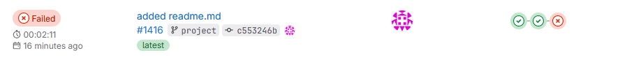
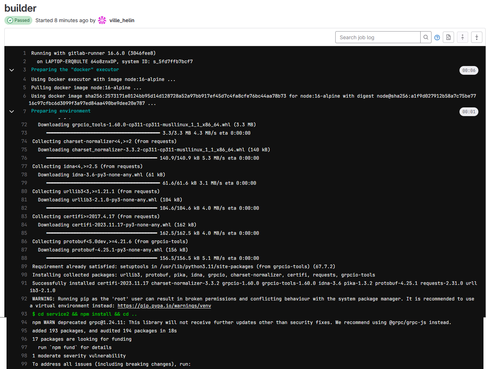
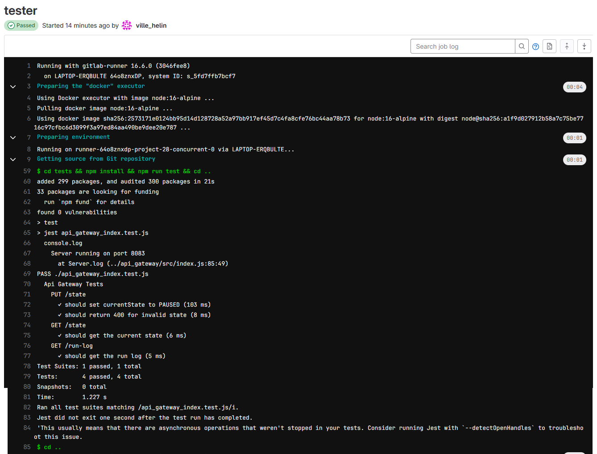
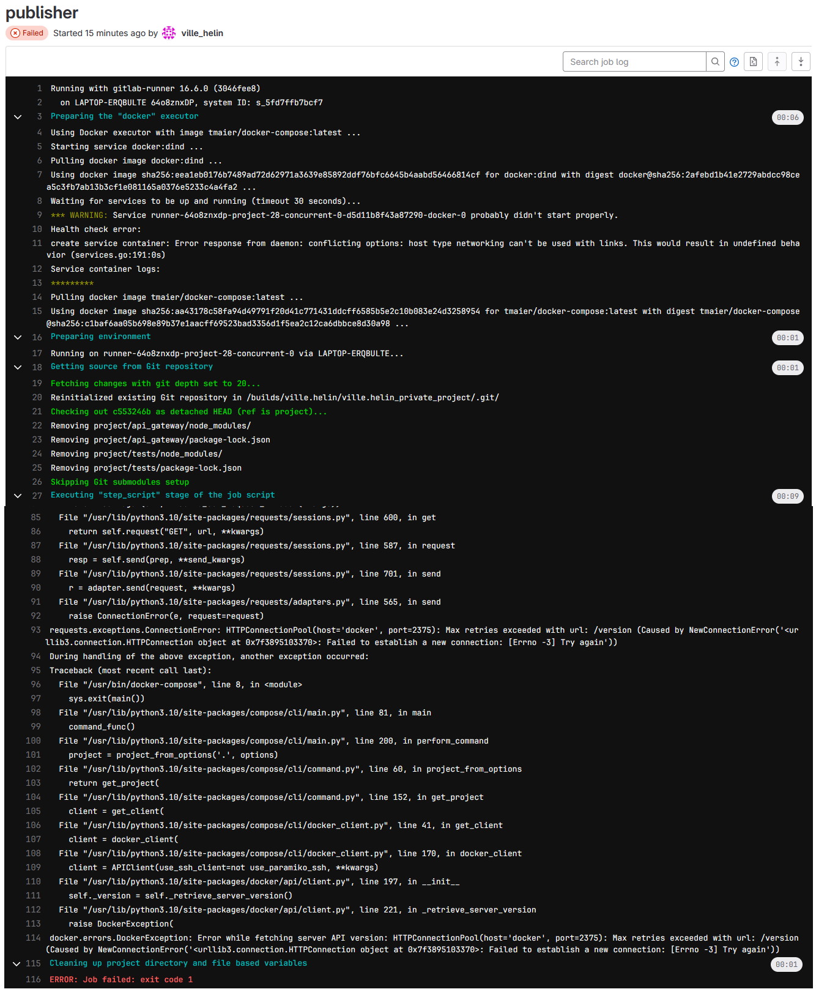

# Project Document

## Instructions for examiner to test the system

### Running the project

```
docker compose up --build
```

Handling the api-gateway container can be done with te following calls  
`curl localhost:8083/messages`  
`curl localhost:8083/state -X PUT -d "INIT" -H "Content-Type: text/plain"`  
`curl localhost:8083/state -X PUT -d "RUNNING" -H "Content-Type: text/plain"`  
`curl localhost:8083/state -X PUT -d "PAUSED" -H "Content-Type: text/plain"`  
`curl localhost:8083/state -X PUT -d "SHUTDOWN" -H "Content-Type: text/plain"`  
`curl localhost:8083/state`  
`curl localhost:8083/run-log`  

### Running tests

```
cd project/tests && npm install && npm run test && cd .. && cd .. 
```

## Description of the CI/CD

The CI/CD Pipeline has 2 working phase build and test. Deploy-phase was meant to be done with docker-in-docker but never got it to work. Pipeline is automatically run everytime when pushing into the branch with the pipeline. Build-phase consists of testing if the enviroment can install requirements and run current application. For test-phase jest is used for testing api-gateway application and one test is created for each implemented call expect messages which require monitor application to be running and it never runs when it just waits for rabbitmq in this case. Tests can be found at folder `project/test`.

## Example run of the pipeline






## Reflections

### Main learnings and worst difficulties

Main learning was to setup self-hosted gitlab runner and making gitlab CI/CD pipeline. Alot of the code was already made on earlier phases in the course and it made it that the main focus was on CI/CD pipeline. Difficult was to get self-singed certificate for the course provided gitlab to work like it should have been from start and never got the docker-in-docker in the CI/CD pipeline to work. It took so many hours and never found an answer for it. 

### Amount effort (hours) used

Estimated ~35 hours were used for this project part.